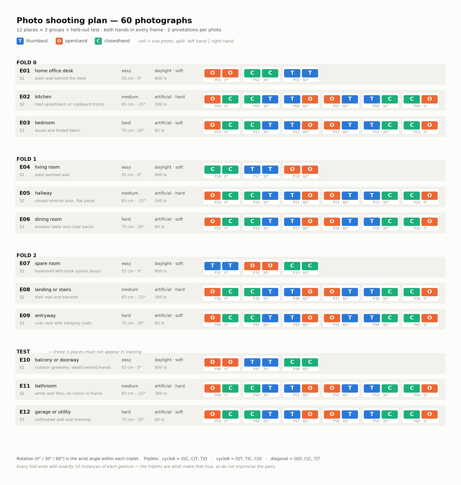

# Data collection protocol

How to build a dataset equivalent to the one this study used.

**Why this document exists.** The source photographs are not distributed — they show an
identifiable person's face and home interior. Everything needed to reproduce the *analysis*
is in this repository (prediction dumps, fold assignments, per-model metrics), but
reproducing the *study* means collecting images again. This is that recipe.

Follow it and you get a dataset with the same structure, the same balance guarantees, and
the same evaluation protocol. It does **not** have to be the same person, the same rooms, or
the same country — those are the parts worth varying.

---

## The chart

<picture>
  <source media="(prefers-color-scheme: dark)" srcset="figures/shooting_chart_dark.png">
  
</picture>

**One row per place, one cell per photo.** Each cell is split `left hand │ right hand` and
lettered **T** / **O** / **C**, so it stays readable in greyscale, in print, and for
colour-blind users — the colour is secondary encoding, never the only cue.

Print it, or keep it open on a phone while shooting. Regenerate with
`python3 scripts/shooting_chart.py` if you change the plan.

---

## 1. What you are collecting

60 photographs. **Both hands visible in every frame**, each hand making one of three gestures:

| class | index | mask value | description |
|---|---|---|---|
| `thumbout` | 0 | 200 | closed fist, thumb extended sideways |
| `openhand` | 1 | 100 | flat palm to camera, fingers spread |
| `closedhand` | 2 | 255 | closed fist, thumb tucked against the fingers |

That is **120 annotations** — 40 per class, 2 per photo.

> **The single most important instruction in this document.** `thumbout` and `closedhand`
> differ by one digit, and they account for **79 of 80 classification errors** across every
> model trained in this study. `openhand` is essentially never confused with either.
>
> When you shoot `thumbout`, extend the thumb **fully and clearly to the side**, roughly
> perpendicular to the fist — a hitchhiker's thumb, not a half-tucked one. When you shoot
> `closedhand`, tuck the thumb **flat against the index and middle fingers** so no thumb
> silhouette breaks the outline of the fist. If you are unsure which one a photo shows, the
> model will be too.
>
> Four photographs in the original collection had to be relabelled because the thumb was
> bent rather than extended. Budget for that.

---

## 2. Structure: 12 places × 3 groups + a test set

The 60 photos come from **12 distinct places** — different rooms, different backgrounds,
different lighting. Places are assigned to folds so that **no place appears in two folds**.

This is not decoration. Backgrounds dominate the frame, so a random split lets a model
score by memorising a room rather than recognising a hand. Place-disjoint folds are what
make the cross-validation number mean something.

| group | places | photos |
|---|---|---|
| fold0 | E01, E02, E03 | 15 |
| fold1 | E04, E05, E06 | 15 |
| fold2 | E07, E08, E09 | 15 |
| **test** | E10, E11, E12 | 15 |

**The three test places must not appear anywhere in training.** Pick them first and keep
them aside, so you cannot accidentally shoot a training photo there.

Each group of three places contains one of each difficulty:

| slot | difficulty | lighting | distance | tilt | sleeves | accessory |
|---|---|---|---|---|---|---|
| S1 | easy | diffuse daylight, ~800 lux, no lamp | 55 cm | 0° | short, forearms bare | none |
| S2 | medium | ceiling light only, ~300 lux, blinds shut | 65 cm | −15° | long, striped or patterned | watch, image-left |
| S3 | hard | one dim lamp, ~60 lux, no ceiling light | 75 cm | +20° | long dark, hoodie cuffs | bracelet, image-right |

The full specification is in [`collection/environments.csv`](collection/environments.csv);
the per-photo shot list is [`collection/shotlist.csv`](collection/shotlist.csv) and
[`shot_list.xlsx`](collection/shot_list.xlsx).

Lux figures are targets, not requirements — a phone light meter is enough. The point is that
each fold contains one bright, one moderate and one dim place, so no fold is systematically
easier than another.

---

## 3. Balance: why the gesture pairs are what they are

Every place is shot as **triplets** — three photos that between them use each class exactly
twice, once per hand:

```
cycleA    (left, right):  (open, closed)  (closed, thumb)  (thumb, open)
cycleB    (left, right):  (open, thumb)   (thumb, closed)  (closed, open)
diagonal  (left, right):  (open, open)    (closed, closed) (thumb, thumb)
```

- **S1** places (easy) shoot `diagonal` only → 3 photos
- **S2** and **S3** places shoot `cycleA` + `cycleB` → 6 photos each

The result is exactly **10 instances of each class in every fold** and each gesture appearing
on the left hand as often as the right — balance by construction, so nothing has to be thrown
away afterwards to achieve it.

Do not improvise the pairs. The triplets are what make the arithmetic work.

### Rotation

Within each triplet, rotate the hands **0°, 30°, 60°** across the three photos. This gives
the oriented-box arm something to learn. (It turned out oriented boxes did not help — see
`REPORT.md` §7 — but the rotation variety is still worth having.)

---

## 4. Shooting

1. **Pick your 12 places first.** Write them into a copy of `environments.csv` before
   shooting anything. Reserve three for the test set.
2. **One place at a time**, in the order the shot list gives. Do not interleave places — the
   original study recovered its fold assignment from capture order when metadata was lost,
   and block ordering is what made that possible.
3. **Both hands in frame, fully visible.** No cropping at the frame edge. The QA script flags
   any hand within 3 px of the border.
4. **Camera at roughly chest height**, hands forward of the body, at the distance and tilt
   the slot specifies. A laptop webcam or phone front camera is representative — the
   instrument will use one.
5. **Fill in `captured` in the shot list as you go.** It is much harder to reconstruct later.

### Framing

Hands should occupy a substantial fraction of the frame — this is a close-range instrument.
In the original dataset the hands are large enough that 320 px input still resolves a thumb,
which is *why* 320 px turned out to be both faster and more accurate than 640 px. If you
shoot from across a room, that result will not reproduce.

---

## 5. Annotation

Annotate as **grayscale masks**, one PNG per photo, same stem as the image:

- background = 0
- `thumbout` = **200**
- `openhand` = **100**
- `closedhand` = **255**

Any tool that exports indexed masks works; the original used QuPath. `scripts/build_pool.py`
converts masks to both axis-aligned and oriented YOLO labels plus COCO JSON, and refuses
blobs under 200 px as noise.

### Quality control

Run the QA pass and **look at the overlays**:

```bash
python3 scripts/mask_qa.py --out qa_overlays
```

It scores each mask by Sobel edge alignment — how well the mask boundary sits on the image
gradient — and flags anything below 0.80 that would improve by more than 6 px if moved.

> Two lessons from the original collection, both of which cost time:
>
> **Score alone is not evidence.** Open the alpha-0.5 overlays and eyeball them. An earlier
> version of this QA used skin-colour scoring, which broke completely on backlit hands and
> passed masks that were visibly wrong.
>
> **Backlit hands are where automatic annotation fails.** All four hands the automatic pass
> left unlabelled were backlit. If a place has a bright window behind the subject, expect to
> annotate those by hand.

Fix bad masks **by hand** rather than regenerating — `scripts/install_manual_masks.py` merges
a corrected export per-class, so a hand-drawn class wins for that class without overwriting
the rest of the mask.

---

## 6. Verify before you train

```bash
python3 scripts/build_pool.py
python3 -c "
import json, collections, glob
for p in sorted(glob.glob('data/pool/coco/instances_*.json')):
    js = json.load(open(p))
    c = collections.Counter(a['category_id'] for a in js['annotations'])
    print(p.split('instances_')[1][:-5], len(js['images']), 'imgs',
          len(js['annotations']), 'anns', dict(sorted(c.items())))
"
```

You are looking for exactly this:

```
fold0  15 imgs 30 anns  {1: 10, 2: 10, 3: 10}
fold1  15 imgs 30 anns  {1: 10, 2: 10, 3: 10}
fold2  15 imgs 30 anns  {1: 10, 2: 10, 3: 10}
test   15 imgs 30 anns  {1: 10, 2: 10, 3: 10}
```

If the counts differ, something went wrong in shooting or annotation. Fix it now — every
number downstream inherits this.

(COCO categories are 1-indexed, which is why DEIMv2 is configured with `num_classes: 4`
rather than 3. Slot 0 is never trained.)

---

## 7. What to do differently

The original dataset's limitations, and what they cost. If you are collecting fresh, these
are the improvements worth making:

**Collect from more than one person.** This is the big one. Every accuracy figure in the
study comes from a single subject, so the numbers should be read as an upper bound on what a
second person would get. Two or three subjects, with subject-disjoint folds as well as
place-disjoint, would turn "generalises across rooms" into "generalises across people".

**Collect across several days.** All 60 photos were taken in one day. Same haircut, same
lighting conditions, same camera position habits. Multiple sessions would test something a
single sitting cannot.

**Consider redesigning `thumbout`.** Given the confusion structure, a gesture that differs
from a fist by more than one digit would make the whole vocabulary easier — this is a
cheaper fix than any modelling change. If the vocabulary is fixed for musical reasons, expect
that pair to carry your error and handle it at the MIDI-mapping layer.

**60 photos is small.** Fold-to-fold SD in this study runs 0.02–0.07, which is the resolution
limit of every comparison in it. More data would narrow that; nothing else will.

---

## 8. Consent and distribution

The photographs show a person, not a disembodied hand — face, clothing and home interior are
in frame. Before collecting:

- Get **explicit consent** from every subject, covering how images will be stored and whether
  they may be published.
- Decide the distribution question **before** shooting, not after. If you intend to open the
  dataset, say so in the consent and consider framing that excludes faces.
- If you do not intend to publish the images, keep them out of the repository. This one
  excludes them via `.gitignore` and stores them in a private bucket with public access
  prevention enforced.

Publishing the *derived* artifacts — prediction dumps, metrics, fold assignments — carries
none of that risk, and is enough for anyone to verify the analysis.
