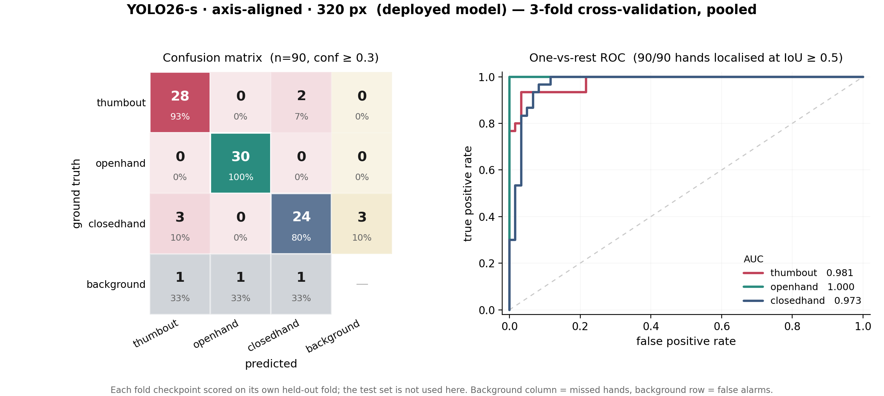
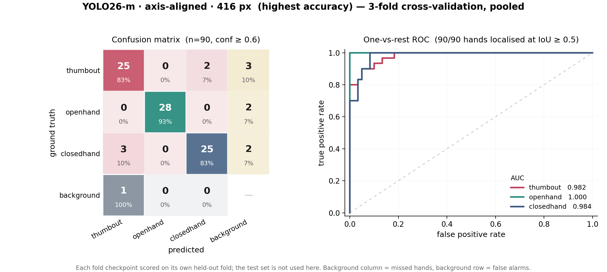
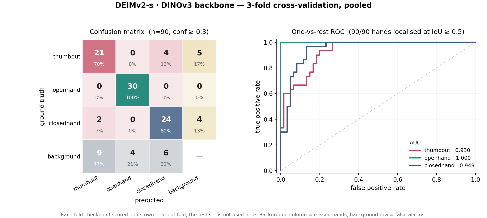
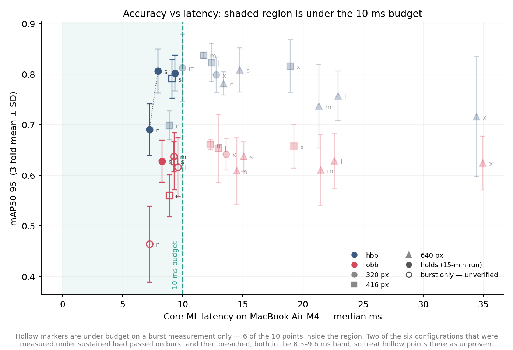
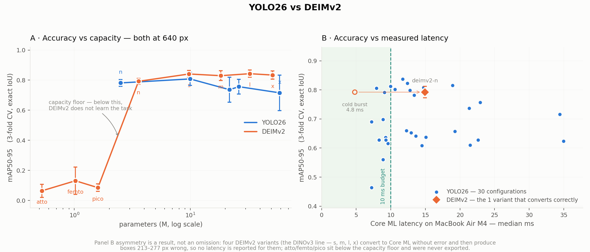

# Hand-Gesture MIDI Instrument on a Consumer Laptop

**A study of whether vision-based gesture recognition is deployable on a MacBook Air M4.**

Full record: planning, dataset construction, training, evaluation, results, and the reasoning
behind each decision — including the decisions that turned out to be wrong and how they were
caught.

Every number here comes from a file in this repository. Where a claim was revised mid-study,
the revision is shown rather than the history quietly replaced, because the revisions are the
most instructive part.

---

## 1. The question

Can a hand-gesture instrument — camera in, MIDI out — run on a laptop a musician would
actually own, with latency low enough to play?

That splits into two measurements that must be made together:

- **Accuracy**: can a model tell three hand gestures apart, on both hands, across rooms and
  lighting it has never seen?
- **Latency**: does it run fast enough on the target machine — *not* on the GPU that trained it?

Neither number alone answers the question. A model that is accurate and slow is not an
instrument; a model that is fast and inaccurate plays wrong notes.

### The 10 ms budget, and what it actually means

The target is **10 ms for the model**. This is an *engineering* budget, not a perceptual
threshold. The full chain — camera exposure, readout, USB transport, inference, MIDI —
costs 55–80 ms on this machine, and the camera alone accounts for 30–50 ms of that, which no
amount of model optimisation reduces. Spending 10 ms on the model is a decision about where
the controllable budget goes.

A second criterion matters as much and is easy to forget: **jitter**. Uniform lag can be
anticipated by a player; variable lag cannot. Trained musicians' inter-onset SD is around
10–20 ms, so p95 − median is reported everywhere alongside the median.

---

## 2. Planning

### Decision: 3-fold cross-validation, not a single split

With 60 photos, a single train/val split makes every conclusion hostage to which photos
landed where. Three folds give a **mean ± SD** per configuration, and the SD turns out to be
the single most important number in the study: fold-to-fold spread runs 0.02–0.07, which sets
the resolution limit of every comparison. Differences smaller than that are not real, and
several apparent "wins" during the study fell inside it.

### Decision: folds are disjoint by *place*, not random

Random splits would put photos of the same room in both train and validation, letting a model
score by memorising a background rather than recognising a hand. The 60 photos were shot
across **12 places**, and folds are assigned so no place appears in two folds. This makes the
numbers lower and honest.

> **This was got wrong first.** An early version grouped photos by *lighting cluster*, on the
> theory that lighting was the confound. It wasn't — place was, since background pixels
> dominate the frame. The shot list had recorded capture order in blocks all along, so the
> correct grouping was recoverable. `scripts/assign_places.py` replaced the clustering
> approach, which was deleted rather than left as an option.

### Decision: a shot list, written before any photo was taken

`collection/shot_list.xlsx` specifies all 60 photos — which gesture on which hand, in which
place, under which lighting. Two reasons:

1. **Balance by construction.** Every fold gets exactly 10 instances of each class, and each
   gesture appears on the left hand as often as the right. Balance achieved by post-hoc
   filtering would have meant discarding photos and shrinking an already small dataset.
2. **Both hands in every frame.** The instrument reads two hands simultaneously, so training
   on single-hand crops would not match deployment.

The resulting dataset — verified, not assumed:

```
fold0  15 photos  30 annotations  {thumbout 10, openhand 10, closedhand 10}
fold1  15 photos  30 annotations  {thumbout 10, openhand 10, closedhand 10}
fold2  15 photos  30 annotations  {thumbout 10, openhand 10, closedhand 10}
test   15 photos  30 annotations  {thumbout 10, openhand 10, closedhand 10}
```

### Decision: annotate by hand where the automatic masks were wrong

Automatic mask generation left 4 of 120 hands unlabelled — all backlit. Rather than train on
a dataset with known holes, those were annotated manually in QuPath and merged with a script
that lets a hand-drawn class win per-class rather than overwriting the whole mask.

A separate QA pass then found **4 fists mislabelled as thumbout**. They were caught by
scanning for a geometric signature (a negative `thumb_straight` value = a bent thumb) rather
than by eye. This matters later: the class pair involved is the same one the trained models
find hardest, which suggests the difficulty is intrinsic to the gestures, not to the labels.

---

## 3. Model selection

### Decision: two architecture families, not one

**YOLO26** (n/s/m/l/x) is the obvious baseline: mature, exports cleanly, well understood.
**DEIMv2** was added as the "faster model" — a DETR variant that is **NMS-free**, which is the
property that matters for latency, since non-maximum suppression is awkward on the Apple
Neural Engine.

Both were run in **two box geometries** — axis-aligned (HBB) and oriented (OBB) — because a
hand at an angle is poorly described by an upright rectangle, and OBB was expected to win.

### Decision: three input resolutions

320, 416 and 640 px. Originally intended as a pure accuracy-for-latency trade. It turned out
to be the single most consequential axis in the study, in the opposite direction to
expectation (§7, and Figure 5 in §8).

**Total: 90 YOLO runs (5 sizes × 2 geometries × 3 resolutions × 3 folds) + 24 DEIMv2 runs
(8 variants × 3 folds) = 114 training runs.**

---

## 4. Training

Trained on rented GPUs — Kaggle T4 for the 640 px cells, a vast.ai RTX 4090 for the rest and
for all of DEIMv2. Three problems were worth the effort of solving properly.

### Problem: DEIMv2's variants were not training under comparable schedules

DEIM trains in **two stages**, switching at `collate_fn.stop_epoch` — augmentation off, then a
fine-tune phase. That value ships *inside each variant's own COCO recipe*, and the recipes
differ wildly: 120 epochs for `s`, 60 for `l`, 468 for `atto`, 148 for `n`.

Setting `epoches: 120` and nothing else does **not** give each variant a 120-epoch version of
its own recipe. It gives each an arbitrary slice of a *different* recipe: `s`, `atto` and `n`
never reached the switch at all, while `l` and `x` did. Half the arm got a fine-tune stage and
half never did.

The observed spread — `s` at 0.843 against `l` at 0.374 — was therefore **substantially
measuring the schedule, not the architecture**, which is precisely the comparison the study
exists to make. The whole DEIMv2 arm was discarded and re-run under one pinned schedule
(120 epochs, `flat_epoch` 64, `no_aug_epoch` 20, `stop_epoch` 100, `matcher_change_epoch` 90).
All 24 re-runs logged `Refresh EMA at epoch 100`, confirming every variant genuinely executed
stage 2. A pre-flight check now refuses any config where `stop_epoch >= epoches`.

### Problem: a checkpoint pruner was killing runs

Disk pressure required deleting per-epoch checkpoints during training. The first version kept
"the newest 2 `.pth` by mtime" — but DEIMv2 **reloads `best_stg1.pth`** at the stage transition.
Once a run's best score plateaued, that file became the oldest, was deleted, and training died
at epoch 62 of 120. It only affected models that plateau, i.e. exactly the ones whose numbers
you would most want to trust. Now only the disposable numbered checkpoints are removed, and
never a file written in the last 30 seconds.

### Problem: parallelism, and a silently-skipped failure

Running one training job at a time left the RTX 4090 at **6% utilisation** — this workload is
overhead-bound, not compute-bound, so a faster GPU bought only ~15%. Eight parallel workers
took it to 88% and turned a projected 4.5 hours into ~1.5.

That caused one CUDA OOM (`hbb-x-fold2-416`) — and exposed a worse bug: the resume logic
counted *failed* cells as done, so the sweep would have reported "60/60" with a silent hole.
Fixed; the failed cell was picked up automatically on re-run.

---

## 5. Evaluation

### Decision: pool the three folds for confusion matrices

A per-fold confusion matrix is built from 30 annotations, where one mistake moves a cell by
3%. Instead, each model's three fold checkpoints are each scored on **the fold they were held
out from**, and the three are pooled — 90 annotations per matrix, every prediction from a
model that never trained on that image, and **the test set never touched**.

### Decision: the operating threshold is per-model, and it has to be

A confusion matrix needs a confidence threshold. The conventional 0.25 is unfair across
architectures: YOLO26 applies NMS, DEIMv2 does not. DEIMv2 emits 300 unsuppressed queries per
image, so several survive on the same hand and every one after the first counts as a false
alarm — 44–150 false alarms against YOLO26's 10–25, dragging `deimv2/m` to macro-F1 **0.46**
despite an AP50-95 of 0.829.

Each model is therefore reported at its own F1-optimal threshold, with the fixed-0.25 numbers
kept alongside. The caveat is stated in every output: that threshold is tuned on the same
predictions it scores, so P/R/F1 are an upper bound. **AUC is threshold-free**, which is why
it leads the comparison.

### Decision: compute IoU exactly, for every architecture

Ultralytics matches oriented boxes with **ProbIoU** (a Gaussian surrogate) and axis-aligned
boxes with real box IoU — verifiable at `obb/val.py:94` vs `detect/val.py:317`. Its OBB and
HBB numbers are therefore not on the same scale, and neither is on DEIMv2's.

A single evaluator (`scripts/test_eval.py`) recomputes COCO-style AP for all three using exact
geometry: polygon intersection via `cv2.intersectConvexConvex` for OBB, box IoU otherwise.

**Measured** discrepancy, over the 30 cells at 640 px:

| geometry | ultralytics − exact IoU |
|---|---|
| hbb (control) | **+0.0032 ± 0.0188** |
| obb | **+0.1747 ± 0.0342** |

The control is what makes this credible: on axis-aligned boxes, where both use the same
definition, the evaluators agree to ~0.003. The evaluator was independently validated a
second time against **COCOeval** on the DEIMv2 arm: **+0.0008 ± 0.0028**.

So one evaluator agrees with two independent implementations everywhere, and disagrees with
ProbIoU by +0.175 on OBB. The divergence is attributable to ProbIoU, not to the new code.

> **Correction worth recording.** For much of this study the ProbIoU inflation was quoted as
> "about +0.11, from the literature". That figure had **no source** — it was asserted, not
> measured or cited, and it propagated into code comments before being checked. The measured
> value is +0.175. Had it truly been 0.11, the corrected OBB cells would still have looked
> competitive; at 0.175 they clearly are not. The fabricated number would have understated a
> conclusion-reversing effect.

---

## 6. Latency

### Decision: measure on the target laptop, and only via Core ML

Every latency figure was measured on the **Apple M4 (Mac16,12)** — the script refuses to run
on anything but Darwin, and each result file records the host. A datacentre GPU answers a
question nobody asked.

PyTorch-MPS is reported for reference but not used for conclusions, because it carries ~18 ms
of fixed dispatch overhead that swamps everything else:

| hbb-n | 320 | 416 | 640 |
|---|---|---|---|
| PyTorch-MPS | 18.47 | 19.99 | 18.03 |
| **Core ML** | **7.09** | **8.57** | **13.39** |

On MPS a 4× change in pixel count moves latency by 2 ms and is **not even monotonic**.
Under Core ML the same model spans 6.3 ms, monotonically. The Neural Engine removes the fixed
overhead, and only then does model size become visible. Core ML also collapses jitter from up
to 12.4 ms to under 2.6 ms.

> **Correction worth recording.** On the MPS evidence alone the conclusion was "resolution is
> not a latency lever" — and the 60 lower-resolution training cells were nearly dropped as not
> worth running. The Core ML numbers reversed that completely. Measuring the deployment
> runtime before drawing conclusions about the deployment target would have avoided it.

### Decision: measure *sustained* latency, because the machine is fanless

Burst benchmarks (a few seconds) describe a cold machine. An instrument runs continuously, and
a MacBook Air has no fan. Every candidate was therefore also run for **15 minutes** with
latency bucketed into 15 wall-clock windows.

| model | thermal start | median ms | p95 | first → last window | verdict |
|---|---|---|---|---|---|
| hbb-n@320 | cold | 7.22 | 8.05 | 7.19 → 7.91 | **holds** |
| hbb-s@320 | cold | **7.93** | 8.83 | 7.72 → 8.26 | **holds** |
| obb-s@320 | cold | 8.29 | 9.79 | 7.73 → 8.53 | **holds** |
| hbb-n@416 | cold | 8.88 | 12.47 | 8.74 → 10.84 | breach @ 540 s |
| hbb-s@320 | *preheated* | 9.38 | 12.07 | 7.87 → 9.19 | breach @ 300 s |
| hbb-m@320 | cold | 9.96 | — | 9.17 → 10.08 | breach @ 360 s |
| hbb-l@320 | *preheated* | 10.60 | 14.43 | 9.76 → 11.33 | breach @ 360 s |

Three findings, each of which changed a verdict:

**Sustained load costs +0.5 to +2.1 ms, and it arrives as a step, not a drift.** Latency sits
flat for 5–9 minutes, transitions, and plateaus. A burst median above roughly 8 ms does not
survive. Four configurations that passed the burst test fail here.

**Thermal start matters as much as the model.** `hbb-s@320` read 9.38 ms preheated and
**7.93 ms cold** — a 1.45 ms difference, larger than the gap between several models. Within a
batch only the first model starts cold, and 60 s of cooldown does not undo a 15-minute run.
The preheated reading would have disqualified the model that is now the deployment choice.

**A median under budget is not a pass.** `hbb-m@320` medians 9.96 ms — under 10 — yet sits
above the budget for its final nine windows. The verdict must be per-window.

### Decision: report no DEIMv2 latency where the export is wrong

DEIMv2 has no Core ML path; one was written (`scripts/export_coreml_deim.py`), which required
fixing three converter incompatibilities: a rank-1 `linear` (D-FINE's distribution-integral
head), float `gather` indices from lowered integer floor-division, and `aten::gather` arity.

The result:

- **`n` (HGNetv2)** converts and reproduces PyTorch exactly — 0.57 px box deviation. ~5–7 ms.
- **`s`/`m`/`l`/`x` (DINOv3)** convert *without error* and produce boxes 213–277 px wrong.

Latency for those four is **deliberately not reported**. The exporter refuses to time a model
that fails numerical verification, so this is enforced in code rather than left to discipline.
DEIMv2 also cannot change resolution — the architecture is fixed at 640.

---

## 7. Results

### Accuracy — YOLO26, exact IoU

| cell | CV mAP50-95 | test mAP50-95 | macro AUC |
|---|---|---|---|
| hbb-m@416 | **0.8373 ± 0.0056** | 0.7658 | **0.9885** |
| hbb-l@416 | 0.8225 ± 0.0376 | 0.7552 | 0.9848 |
| hbb-x@416 | 0.8155 ± 0.0519 | 0.7836 | 0.9841 |
| hbb-m@320 | 0.8122 ± 0.0667 | 0.7443 | 0.9872 |
| hbb-s@640 | 0.8080 ± 0.0438 | 0.7574 | 0.9826 |
| **hbb-s@320** | **0.8056 ± 0.0437** | 0.6855 | 0.9846 |

**The top twelve cells are all HBB.** Oriented boxes, expected to win, lose across the board
once scored with exact geometry.

**Lower resolution is more accurate, not merely faster.** Every 640 px cell is beaten by cells
at 416 or 320. With 60 training images, 640 px appears to give the model more room to overfit;
hands occupy a large fraction of the frame, so 320 px still resolves a thumb — the one feature
that separates the hard class pair.

### Accuracy — DEIMv2

| variant | CV | test | macro AUC |
|---|---|---|---|
| l | 0.8428 | 0.7928 | 0.9672 |
| s | 0.8409 | **0.8014** | 0.9596 |
| x | 0.8337 | 0.7824 | 0.9715 |
| m | 0.8295 | 0.7591 | 0.9387 |
| n | 0.7922 | 0.7428 | 0.9350 |
| femto | 0.1309 | 0.0787 | 0.5861 |
| pico | 0.0850 | 0.0397 | 0.4949 |
| atto | 0.0642 | 0.0117 | 0.5115 |

**DEIMv2 has a hard capacity floor.** pico (0.085) → n (0.792) is a ~9× jump for ~2× the
parameters. Below `n`, these models do not learn the task at 60 training images at all — those
are failures, not weak results.

**Above the floor, both families are flat.** DEIMv2 spans 0.792–0.843 from n to x; YOLO26
spans 0.699–0.837 across a 24× parameter range. Once capacity clears the threshold, more of it
buys almost nothing at this dataset size — which is exactly why a laptop deployment is
feasible: the smallest model above the threshold is nearly as good as the largest.

**Backbone caveat.** DEIMv2 s/m/l/x are DINOv3-backboned; atto/femto/pico/n are HGNetv2. A
DEIMv2 win at the top is *foundation-model pre-training + a DETR head*, not architecture
alone. On the clean HGNetv2-vs-YOLO26 comparison, DEIMv2-n (0.792) sits below the best YOLO26
cell (0.837).

### Error structure — one hard pair

Pooled over the 15 models that learned the task:

**79 of 80 class confusions are thumbout ↔ closedhand. Exactly one involves openhand.**

| class | mean AUC |
|---|---|
| openhand | 0.9985 |
| thumbout | 0.9508 |
| closedhand | 0.9509 |

thumbout is a closed fist with the thumb extended — one digit from closedhand — while openhand
differs in global hand shape. thumbout and closedhand score lower *only* because they are
confused with each other.

This is the same pair that produced the four annotation errors during dataset construction,
which is corroboration that the difficulty is intrinsic to the gesture vocabulary rather than
an artifact of labelling. **It is a gesture-design problem, not a model problem** — and the
cheapest fix is redesigning `thumbout` to differ from `closedhand` by more than a thumb.

### Generalisation

Mean CV → test gap: **−0.042** (YOLO), **−0.052 ± 0.011** (DEIMv2). Uniform across a 6.6×
capacity range, which is what an honest generalisation gap looks like — the test set is four
unseen places.

One exception matters: **`hbb-s@320` has the worst gap in the study, −0.120.** Its CV
advantage transfers less well than its neighbours'.

---

## 8. Figures

All figures below are also available as **PDF** for typesetting.

### Figure 1 — the deployed model



*Vector version for typesetting: `figures/paper_yolo26_hbb-s-320.pdf`*

**YOLO26-s · axis-aligned · 320 px**, operating threshold 0.30, pooled over the three
cross-validation folds (90 annotations, each predicted by a model that never trained on it).

| ground truth ↓ / predicted → | thumbout | openhand | closedhand | background |
|---|---|---|---|---|
| **thumbout** | **28** (93%) | 0 (0%) | 2 (7%) | 0 (0%) |
| **openhand** | 0 (0%) | **30** (100%) | 0 (0%) | 0 (0%) |
| **closedhand** | 3 (10%) | 0 (0%) | **24** (80%) | 3 (10%) |
| **background** | 1 (33%) | 1 (33%) | 1 (33%) | — |

| class | precision | recall | F1 | AUC |
|---|---|---|---|---|
| thumbout | 0.875 | 0.933 | 0.903 | 0.9806 |
| openhand | 0.968 | 1.000 | 0.984 | 1.0000 |
| closedhand | 0.889 | 0.800 | 0.842 | 0.9733 |

Accuracy over all ground truth **0.9111**, macro AUC
**0.9846**, 90/90 hands localised at
IoU ≥ 0.5. Three misses and three false alarms out of 90.

Reading the matrix: openhand is perfect (30/30, AUC 1.000). Every classification error is
thumbout ↔ closedhand — 2 one way, 3 the other. The three misses are all closedhand, which
is also the class most often confused; a closed fist presents the smallest, least distinctive
silhouette of the three.

---

### Figure 2 — the highest-accuracy model



**YOLO26-m · axis-aligned · 416 px** — the best cell in the study by CV mAP
(0.8373 ± 0.0056) and by AUC (**0.9885**), but it breaches the latency budget under sustained
load (9.96 ms median, above 10 ms for its final nine windows), so it is not the deployed model.

| ground truth ↓ / predicted → | thumbout | openhand | closedhand | background |
|---|---|---|---|---|
| **thumbout** | **25** (83%) | 0 (0%) | 2 (7%) | 3 (10%) |
| **openhand** | 0 (0%) | **28** (93%) | 0 (0%) | 2 (7%) |
| **closedhand** | 3 (10%) | 0 (0%) | **25** (83%) | 2 (7%) |
| **background** | 1 (100%) | 0 (0%) | 0 (0%) | — |

| class | precision | recall | F1 | AUC |
|---|---|---|---|---|
| thumbout | 0.862 | 0.833 | 0.847 | 0.9817 |
| openhand | 1.000 | 0.933 | 0.966 | 1.0000 |
| closedhand | 0.926 | 0.833 | 0.877 | 0.9839 |

Note the higher operating threshold (0.60) and the resulting shape: only **one** false alarm,
but seven misses. It trades recall for precision relative to the deployed model — a defensible
choice for an instrument, where a spurious note is arguably worse than a missed one, and worth
revisiting if the latency budget is relaxed.

---

### Figure 3 — the best DETR



**DEIMv2-s** — highest test-set score in the study (0.8014), but macro AUC 0.9596,
below the top YOLO cells.

| ground truth ↓ / predicted → | thumbout | openhand | closedhand | background |
|---|---|---|---|---|
| **thumbout** | **21** (70%) | 0 (0%) | 4 (13%) | 5 (17%) |
| **openhand** | 0 (0%) | **30** (100%) | 0 (0%) | 0 (0%) |
| **closedhand** | 2 (7%) | 0 (0%) | **24** (80%) | 4 (13%) |
| **background** | 9 (47%) | 4 (21%) | 6 (32%) | — |

| class | precision | recall | F1 | AUC |
|---|---|---|---|---|
| thumbout | 0.656 | 0.700 | 0.677 | 0.9300 |
| openhand | 0.882 | 1.000 | 0.938 | 1.0000 |
| closedhand | 0.706 | 0.800 | 0.750 | 0.9489 |

The background **row** is the story: 19 false alarms against the deployed model's 3.
DEIMv2 is **NMS-free**, so multiple queries survive on the same hand and every one after the
first is counted as a false alarm. This is architectural, not a defect — but it is why AUC,
which is threshold-free, ranks the two families differently from mAP.

---

### Figure 4 — aggregate error structure across all working models

Summed 4×4 over the **35 models** that learned the task (macro AUC ≥ 0.9):

| ground truth ↓ / predicted → | thumbout | openhand | closedhand | background |
|---|---|---|---|---|
| **thumbout** | **784** | 2 | 87 | 177 |
| **openhand** | 0 | **988** | 0 | 62 |
| **closedhand** | 89 | 1 | **784** | 176 |
| **background** | 124 | 114 | 82 | — |

| class | mean AUC | worst model |
|---|---|---|
| openhand | 0.9979 | 0.9650 |
| thumbout | 0.9497 | 0.8533 |
| closedhand | 0.9550 | 0.8906 |

**176 of 179 class confusions are thumbout ↔ closedhand. Exactly 3 involves openhand.**

This is the study's most robust finding: it holds across two architecture families, a 24×
parameter range, three input resolutions and two box geometries. thumbout is a closed fist
with the thumb extended — one digit from closedhand — while openhand differs in global hand
shape. The same pair produced the four annotation errors found during dataset construction,
which is independent corroboration that the difficulty is intrinsic to the gesture vocabulary
rather than an artifact of labelling.

---

### Figure 5 — accuracy versus latency



Every configuration that has both an accuracy and a Core ML latency number. The shaded region
is deployable; points outside it are faded. Error bars are ±1 SD across the three folds.
Where a 15-minute sustained run exists it replaces the burst figure, because that is the
regime an instrument runs in.

Two structures are visible. **Colour separates the geometries** — every blue (HBB) point sits
above the red (OBB) cloud once scored with exact IoU, reversing the expectation that oriented
boxes would suit angled hands. **Marker shape separates resolution** — circles (320 px) and
squares (416 px) sit left of and above triangles (640 px), which is the result that made the
deployment feasible.

The dotted line traces the Pareto front inside the budget: `hbb-n@320` at 7.22 ms / 0.690, and
`hbb-s@320` at 7.93 ms / 0.806. Nothing else is both faster and more accurate.

---

### Figure 6 — YOLO26 vs DEIMv2

<picture>
  <source media="(prefers-color-scheme: dark)" srcset="figures/family_comparison_dark.png">
  
</picture>

*Vector version: `figures/family_comparison_light.pdf`*

Figure 5 compares HBB against OBB and the three resolutions, all **within** YOLO26. This one
compares the two **families**, which is a different question with a different evidence base:
accuracy is fully measurable for both, latency is not.

**Panel A — accuracy vs capacity, both read at 640 px.** The match matters: DEIMv2 is
architecturally fixed at 640 and cannot be run at another resolution, so 640 is the only
common ground.

Two things are visible. DEIMv2 has a **capacity floor** — atto (0.064), femto
(0.131) and pico (0.085) do not learn the task at all, then `n`
jumps to 0.792 for roughly twice the parameters. YOLO26 has no such cliff; its
smallest variant already works. Above the floor **both families are flat**: DEIMv2 spans
0.792–0.843 from n to x, YOLO26 spans
0.716–0.808
across a 24× parameter range. At 640 px DEIMv2 sits consistently **above** YOLO26 — but see
the backbone caveat in §7, since its s/m/l/x line is DINOv3-pretrained.

**Panel B — accuracy vs latency measured on the M4.** YOLO26 contributes all 30
configurations. DEIMv2 contributes **one point**, and that asymmetry is a result rather than
an omission: of its eight variants, four (the DINOv3 line) convert to Core ML *without error*
and then produce boxes 213–277 px wrong, so reporting a latency for them would be reporting
the speed of a model that does not work; three sit below the capacity floor. Only `n`
converts and reproduces PyTorch exactly (0.568 px box deviation).

That single point looked, at first, like it overturned the study: **deimv2-n measures
4.84 ms in a burst** — faster than any YOLO26 configuration — while scoring 0.792 on
cross-validation and **0.743 on the held-out test set, well above the deployed model's 0.686**.

**It does not survive sustained load.** Measured continuously for 15 minutes it runs at
**14.95 ms**, flat, and the collapse is fast:

| | median |
|---|---|
| cold burst, 100 iterations | 4.84 ms |
| immediately repeated | 4.88 ms |
| 20 s of continuous inference | 6.47 ms |
| burst *straight after* that 20 s | **15.95 ms** |
| 15-minute sustained run | **14.95 ms** (60,573 iterations) |

Roughly 20–30 seconds of continuous work takes it from 4.8 ms to ~15 ms, and it stays there
while the load continues. The arrow in Panel B marks that fall.

This is the same effect §6 documents for YOLO26 — but an order of magnitude larger. YOLO's
burst-to-sustained penalty is +0.5 to +2.1 ms and arrives after 5–9 minutes; DEIMv2-n's is
**+10 ms and arrives in under a minute**. A 640 px DETR appears to saturate the Neural Engine's
sustainable power budget in a way the small convolutional detectors do not.

The methodological point is worth more than the number: had this study reported burst latency
only — the default for almost every published benchmark — it would have recommended a model
that is **50% over budget** in the regime it was built for.

**So the deployment recommendation stands, and for a second independent reason.** DEIMv2-n
generalises better than the deployed model on the held-out test set (0.743 vs 0.686) and would
be the stronger choice on accuracy alone — but at ~15 ms sustained it is 50% over the latency
budget, and it cannot trade resolution for speed because the architecture is fixed at 640 px.
Beyond that, one working Core ML export out of eight variants is not a basis for recommending
a family. YOLO26 is recommended for sustained latency and toolchain reliability, not for
superior accuracy.

---

## 9. The deployment choice

Pareto front within the sustained-latency budget:

| config | CV mAP | test mAP | sustained | verdict |
|---|---|---|---|---|
| hbb-n@320 | 0.6902 | 0.7006 | 7.22 ms | holds |
| **hbb-s@320** | **0.8056** | 0.6855 | **7.93 ms** | **holds** |

**Selected: YOLO26-s, axis-aligned, 320 px.**

| | |
|---|---|
| accuracy (3-fold CV, exact IoU) | 0.8056 ± 0.0437 mAP50-95 |
| macro AUC-ROC | 0.9846 |
| held-out test (30 annotations) | 0.6855 ± 0.0500 |
| sustained latency, 15 min from cold | **7.93 ms** median, p95 8.83 |
| budget | holds all 15 windows, 111,884 iterations |
| misses / false alarms (90 annotations) | 3 / 3 |

Selected on **cross-validation**, which is the methodologically correct basis — the test set
was then read once, for all 38 models, as corroboration rather than as a selection tool. With
30 annotations one instance moves a class AP by 3.3 points, so the test table shows whether
the CV ranking broadly held; it is not something to re-sort by.

### An honest tension in that choice

On the **test set**, `hbb-m@320` scores 0.744 against `hbb-s@320`'s 0.686 — because `hbb-s@320`
has the study's worst generalisation gap. `hbb-m@320` is excluded only because it breaches the
budget under sustained load (9.96 ms median, above 10 ms for its final nine windows).

So the choice is: **the most accurate model that provably holds 10 ms**. If the 10 ms budget
were relaxed — defensible, given the camera already costs 30–50 ms — `hbb-m@320` becomes the
better model. The data supports either decision cleanly, and it is a design decision about the
latency budget rather than a question the data can settle.

---

## 10. What is not established

- **Sustained latency covers 6 of 30 cells.** The rest are burst-only. The six are the ones at
  or near the budget, which is where it changes a verdict — but the coverage is partial.
- **`hbb-l@320` was measured preheated only**, so its breach is unresolved rather than proven.
- **DEIMv2 latency is measured for one variant.** The DINOv3 line converts silently wrong.
- **Sustained runs are 15 minutes.** The plateau looks stable but was not measured beyond that;
  a full performance is longer.
- **No thermal telemetry.** `pmset -g therm` reports nothing unprivileged on this machine, so
  latency over time is reported as the effect rather than a proxy for the cause.
- **60 photos is a small dataset.** Fold SD of 0.02–0.07 is the resolution limit of every
  comparison here, and it is why the study reports mean ± SD rather than point estimates.

---

## 11. Two errors caught late, and how

Recorded because the method by which they were caught is the argument for trusting the rest.

**A corrupted checkpoint in the results.** `hbb-m-fold1-416.pt` was a 167 MB partial left by a
worker killed during a rebalance; the staging script copied the first matching run directory
rather than the one whose results recorded a completed run. It emitted 300 detections per
image instead of ~7 and scored 0.4957 exact against 0.8449 as reported.

It was caught because the exact-IoU evaluator disagreed with ultralytics on **exactly one HBB
fold** — and HBB is the control where the two must agree. A size scan of all 90 checkpoints
confirmed it was the only anomaly. The control tightened from ±0.055 to ±0.019.

**Thermal contamination of a latency comparison.** Sustained runs were batched two at a time,
so only the first started cold. This was invisible until `hbb-s@320` was re-run deliberately
from cold and came back 1.45 ms faster. The tooling now refuses to let a preheated reading
override a cold one for the same cell.

**The general principle:** every quantitative claim here has an artifact behind it, and the
ones that survived did so because an independent measurement agreed. The exact-IoU evaluator
is trusted because it matches ultralytics on HBB (+0.003) and COCOeval on DEIMv2 (+0.001)
while disagreeing with ProbIoU on OBB (+0.175). A claim with no such cross-check — like the
"+0.11 from the literature" — is exactly the kind that turned out to be wrong.

---

## 12. Summary of decisions

| Decision | Reasoning | Outcome |
|---|---|---|
| 3-fold CV over single split | 60 photos makes one split arbitrary | SD 0.02–0.07 became the study's resolution limit |
| Folds disjoint by place | Backgrounds dominate the frame | Prevents scoring by memorised background |
| Shot list written first | Balance by construction, not filtering | Exactly 10/10/10 per class per fold |
| Manual annotation of 4 hands | Don't train on known holes | Backlit hands recovered |
| Two architecture families | NMS-free DETR is the latency hypothesis | DEIMv2 competitive but unexportable at the top |
| Three resolutions | Expected accuracy-for-latency trade | Reversed: low res is *more* accurate |
| Pinned one DEIMv2 schedule | Stock recipes differ 60→468 epochs | Re-ran the whole arm; made the comparison valid |
| Exact IoU for all architectures | ProbIoU ≠ box IoU ≠ COCOeval | Reversed the OBB-vs-HBB conclusion |
| Per-model operating threshold | NMS-free models flood a fixed threshold | Rescued deimv2/m from a spurious F1 0.46 |
| Core ML, not MPS | 18 ms fixed overhead hides everything | Made resolution a real lever |
| Sustained not burst latency | The laptop is fanless | Disqualified 4 configs that passed burst |
| Per-window verdict, not median | 9.96 ms median can sit above budget | Disqualified hbb-m@320 |
| Cold-start control | 1.45 ms > gap between models | Rescued the eventual deployment choice |
| Refuse to report unverified exports | A wrong number is worse than none | 4 DEIMv2 latencies withheld |
| Select on CV, report test for all | Selection on test inflates by ~1 SD | Ranking corroborated on unseen places |

---

## 13. Conclusion

**A vision-based hand-gesture MIDI instrument is deployable on a MacBook Air M4.**

YOLO26-s at 320 px, axis-aligned, exported to Core ML, sustains **7.93 ms** — well inside the
10 ms budget — for 15 continuous minutes without breaching, at **0.8056 ± 0.0437** mAP50-95
and **0.9846** macro AUC. The remaining error is concentrated almost entirely in one
anatomically adjacent gesture pair, which is addressable by redesigning the gesture rather
than by improving the model.

Three findings generalise beyond this instrument:

1. **Model capacity is not the binding constraint at small dataset sizes.** Both families are
   flat above a threshold, spanning a 24× parameter range for ~0.14 of mAP.
2. **The deployment runtime must be measured before drawing conclusions about deployment.**
   Measuring PyTorch-MPS would have led to abandoning the resolution axis that made the
   result possible.
3. **Burst latency is the wrong benchmark for a continuously-running instrument on passively
   cooled hardware.** Four configurations pass a burst test and fail in performance.

---

## Appendix — files

```
REPORT.md                      this document
results/RESULTS.md             results, condensed
STATUS.md                      operational record, environment, resume instructions
results/cv_exact_iou.json      30 YOLO cells, exact-IoU CV, per fold and per cell
results/test_set.json          38 models on the held-out test set
results/pooled/                38 confusion matrices + AUC + threshold sweeps
results/probiou_check.json     the ProbIoU measurement
results/deim_evaluator_check.json   COCOeval vs exact IoU (evaluator validation)
results/cv_vs_test.json        per-cell generalisation gaps
results/latency_m4_*.json      burst latency, Core ML + PyTorch-MPS
results/latency_sustained*.json     15-minute runs
results/tradeoff.json          the Pareto front
figures/tradeoff.png           accuracy vs latency, deployable region shaded (Figure 5)
figures/paper_*.png .pdf       publication figures: matrix + ROC per model (Figures 1-3)
figures/confusion/  figures/roc/    all 38 models, individually
scripts/paper_figure.py        regenerates any model's publication figure:
                                 python3 scripts/paper_figure.py --model yolo26_hbb-s-320
collection/shot_list.xlsx      the photo plan
midi_results/weights/          90 YOLO checkpoints (4.5 GB)
deim_results/weights/          24 DEIMv2 checkpoints (5.4 GB)
```
